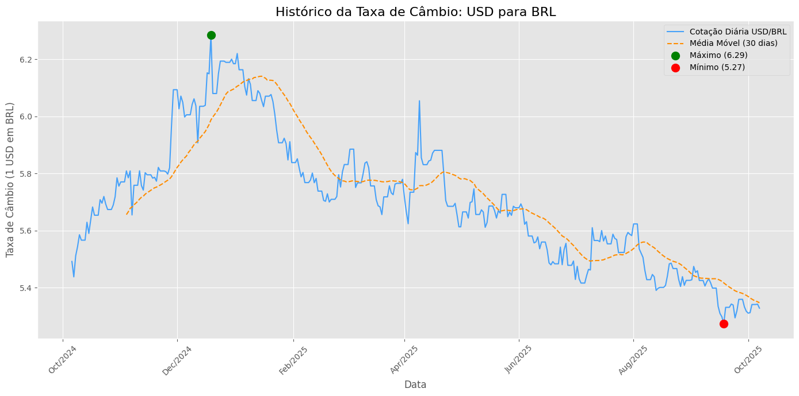

# 💱 Projeto de Cotações de Câmbio — Python + Azure Data Factory

Este projeto demonstra um **pipeline completo de dados**, evoluindo de uma solução local para uma **arquitetura em nuvem utilizando o Microsoft Azure**.

---

## 🧩 Objetivo
Apresentar o ciclo de vida completo de um projeto de dados, desde a **coleta**, **armazenamento** e **análise**, até a **integração em nuvem** com ferramentas de engenharia de dados.

---

## 🧠 Etapas do Projeto

### 🥇 Versão 1 — Local (SQLite)
1. **Coleta de Dados:** Busca de informações de câmbio através da API gratuita [Frankfurter](https://www.frankfurter.app/).  
2. **Armazenamento:** Persistência dos dados em um banco de dados local **SQLite**.  
3. **Análise:** Utilização da biblioteca **Pandas** para calcular estatísticas e média móvel de 30 dias.  
4. **Visualização:** Geração de um gráfico informativo com **Matplotlib**.

### ☁️ Versão 2 — Nuvem (Azure)
1. **Upload de Dados:** O arquivo `cotacoes.csv` é salvo no **Azure Blob Storage**.  
2. **Pipeline de Ingestão:** Configuração de um **Azure Data Factory** que move os dados do Blob para o **Azure SQL Database**.  
3. **Consulta e Validação:** Através do **Azure Query Editor**, verificamos a carga dos dados na tabela `[dbo].[Cotacoes]`.  
4. **Integração Total:** A solução agora está preparada para escalar e integrar com outros serviços de dados no Azure.

---

## 🛠️ Tecnologias Utilizadas

| Categoria | Ferramentas |
|------------|-------------|
| Linguagem | Python 3 |
| Coleta e Processamento | Requests, Pandas |
| Visualização | Matplotlib |
| Banco Local | SQLite |
| Cloud | Azure Blob Storage, Azure Data Factory, Azure SQL Database |

---

## 🚀 Como Executar Localmente (Versão 1 - SQLite)

1. Clone o repositório:
   ```bash
   git clone https://github.com/SEU-USUARIO/NOME-DO-REPO.git
   
2. Navague até a pasta do projeto:
    ```bash
      cd NOME-DO-REPO
   
4. Instale as depedências:
    ```bash
      pip install -r requirements.txt

6. Execute o projeto:
   ```bash
      python cambio_dolar.ipynb


☁️ Como Executar a Versão em Nuvem (Versão 2 - Azure)
   
   1. Gere o arquivo cotacoes.csv através do script Python.
              
   2. Faça o upload para o Azure Blob Storage.


   4. No Azure Data Factory, configure um pipeline para copiar os dados do Blob para o Azure SQL Database.

   5. Valide os dados executando uma query no Azure Query Editor:
      
       ```bash
        SELECT TOP (10) * FROM [dbo].[Cotacoes];


5. Confirme que os dados foram carregados com sucesso na tabela SQL.


📊 Resultados

 A execução local gera o gráfico histórico da taxa de câmbio:

 


 📈 Evolução do Projeto

✅ Versão inicial: SQLite (local)

☁️ Versão atual: Azure (Blob Storage + Data Factory + SQL Database)

🚀 Próximos passos: Automação do pipeline e integração com Power BI para visualizações dinâmicas.
